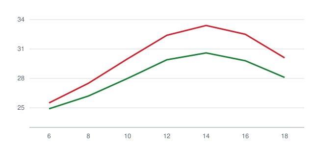
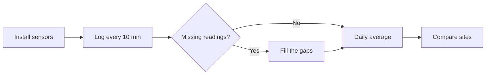

# How Much Cooler Is a Rooftop Garden?

**Summary** — We tracked air temperature, humidity, and surface temperature on three rooftop gardens and one bare roof for ~~one month~~ two months over the summer. The planted roofs were **2.4 °C** cooler on average at midday, and they also cooled down *noticeably* faster after sunset. This write-up covers how we measured, what we found, and what's still open.

> In a city, the heat lets go on small rooftops before it does in big parks.
>
> — Field notebook, July 21

## 1. How we measured

We put the same model of sensor at four sites and logged readings **every 10 minutes**. Here's how the sites compare.

| Site | Floor | Plants | Soil depth | Midday average |
|---|---:|---|---:|---:|
| A · Sunrise Apartments | 5 | Vegetables · herbs | 25 cm | 31.2 °C |
| B · Pine Street Shops | 4 | Grass | 15 cm | 31.8 °C |
| C · Starlight Library | 3 | Perennials | 30 cm | 30.9 °C |
| D · Bare roof (baseline) | 5 | None | — | 33.6 °C |

We took the difference from the bare roof, $\Delta T = T_D - T_i$, and averaged it by day.

$$
\overline{\Delta T} = \frac{1}{N} \sum_{k=1}^{N} \left( T_{D,k} - T_{i,k} \right)
$$

The code for the averages is short.

```python
import pandas as pd

log = pd.read_csv("rooftop_log.csv", parse_dates=["time"])
daily = (log.pivot(index="time", columns="site", values="temp")
            .resample("D").mean())
delta = daily["D"] - daily[["A", "B", "C"]].T  # difference from the bare roof
print(delta.T.mean().round(2))
```

## 2. What we found



*Figure 1 — Temperature by hour (°C). Red is the bare roof; green is the average of the three gardens.*

The gap was widest around 2 p.m., and site C, with the deepest soil, stayed the coolest. Here's the path from sensors to results.



## 3. Still open

- [x] Midday temperature with and without plants
- [x] How fast each roof cools after sunset
- [ ] Check soil depth against coolness at more sites
- [ ] Whether gardens keep roofs warmer in winter

The temperature drop in the two hours after sunset is broken down by day in the [field log](./field-log.json).
