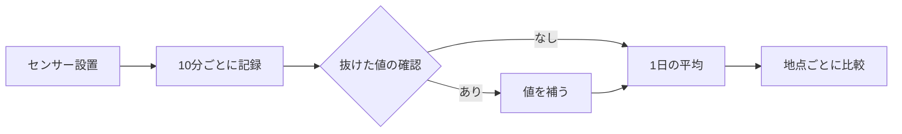

# 屋上菜園はどれくらい涼しいのか

**まとめ** — 屋上菜園 3 か所と、何もない屋上 1 か所で、夏の ~~1 か月~~ 2 か月間、気温・湿度・床面の温度を測りました。植物を育てている屋上は日中の気温が平均 **2.4 °C** 低く、日が沈んだあとの冷え方も*目に見えて*早くなりました。ここでは測り方と結果、そして残った疑問をまとめます。

> 街の熱は、広い公園よりも狭い屋上から先に冷めていく。
>
> — 現地メモ、7月21日

## 1. 測り方

4 か所に同じ型のセンサーを置き、**10 分ごと**に記録しました。各地点の条件は次のとおりです。

| 地点 | 階 | 植物 | 土の深さ | 日中の平均気温 |
|---|---:|---|---:|---:|
| A · 朝日ハイツ | 5 | 野菜 · ハーブ | 25 cm | 31.2 °C |
| B · 松風ビル | 4 | 芝生 | 15 cm | 31.8 °C |
| C · 星見図書館 | 3 | 宿根草 | 30 cm | 30.9 °C |
| D · 何もない屋上（比較用） | 5 | なし | — | 33.6 °C |

気温の差は、何もない屋上との差 $\Delta T = T_D - T_i$ とし、1 日ごとに平均しました。

$$
\overline{\Delta T} = \frac{1}{N} \sum_{k=1}^{N} \left( T_{D,k} - T_{i,k} \right)
$$

平均を出すコードは短いものです。

```python
import pandas as pd

log = pd.read_csv("rooftop_log.csv", parse_dates=["time"])
daily = (log.pivot(index="time", columns="site", values="temp")
            .resample("D").mean())
delta = daily["D"] - daily[["A", "B", "C"]].T  # 何もない屋上との差
print(delta.T.mean().round(2))
```

## 2. 結果


*図1 — 時間ごとの気温（°C）。赤は何もない屋上、緑は菜園 3 か所の平均。*

差がいちばん大きかったのは午後 2 時ごろで、土が深い C 地点がもっとも涼しくなりました。測定からまとめまでの流れは次のとおりです。



## 3. 残った疑問

- [x] 植物の有無による日中の気温差
- [x] 日が沈んだあとの冷え方
- [ ] 土の深さと涼しさの関係を、もっと多くの地点で確かめる
- [ ] 冬の保温効果

日没後 2 時間の気温の下がり幅は、[観測記録](./観測記録.json)に日付ごとにまとめてあります。
