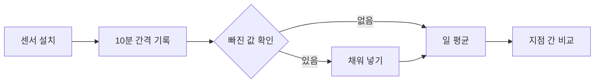

# 옥상 텃밭은 얼마나 시원할까

**요약** — 옥상 텃밭 세 곳과 맨 옥상 한 곳에서 여름 ~~한 달~~ 두 달 동안 기온·습도·표면 온도를 관측했다. 식물을 키우는 옥상은 한낮 기온이 평균 **2.4 °C** 낮았고, 해가 진 뒤 식는 속도도 *눈에 띄게* 빨랐다. 이 글은 관측 설계와 결과, 그리고 남은 질문을 정리한다.

> 도시의 열은 넓은 공원보다 좁은 옥상에서 먼저 식는다.
>
> — 현장 기록장, 7월 21일

## 1. 관측 방법

네 지점에 같은 기종의 센서를 두고 **10분 간격**으로 기록했다. 지점의 조건은 아래와 같다.

| 지점 | 층 | 식물 | 흙 깊이 | 한낮 평균 기온 |
|---|---:|---|---:|---:|
| A · 해오름 빌라 | 5 | 채소 · 허브 | 25 cm | 31.2 °C |
| B · 소나무 상가 | 4 | 잔디 | 15 cm | 31.8 °C |
| C · 별빛 도서관 | 3 | 다년초 | 30 cm | 30.9 °C |
| D · 맨 옥상 (비교용) | 5 | 없음 | — | 33.6 °C |

기온 차이는 맨 옥상과의 차이 $\Delta T = T_D - T_i$ 로 두고, 하루 단위로 평균을 냈다.

$$
\overline{\Delta T} = \frac{1}{N} \sum_{k=1}^{N} \left( T_{D,k} - T_{i,k} \right)
$$

평균을 내는 코드는 짧다.

```python
import pandas as pd

log = pd.read_csv("rooftop_log.csv", parse_dates=["time"])
daily = (log.pivot(index="time", columns="site", values="temp")
            .resample("D").mean())
delta = daily["D"] - daily[["A", "B", "C"]].T  # 맨 옥상과의 차이
print(delta.T.mean().round(2))
```

## 2. 결과


*그림 1 — 시간별 기온 (°C). 빨강은 맨 옥상, 초록은 텃밭 세 곳의 평균.*

오후 2시 무렵 차이가 가장 컸고, 흙이 깊은 C 지점이 가장 서늘했다. 관측부터 해석까지의 흐름은 다음과 같다.



## 3. 남은 질문

- [x] 식물 유무에 따른 한낮 기온 차이
- [x] 해가 진 뒤 식는 속도
- [ ] 흙 깊이와 서늘함의 관계를 더 많은 지점으로 확인
- [ ] 겨울철 보온 효과

해 진 뒤 두 시간 동안의 기온 하강 폭은 [관측 기록](./관측-기록.json)에 날짜별로 정리해 두었다.
