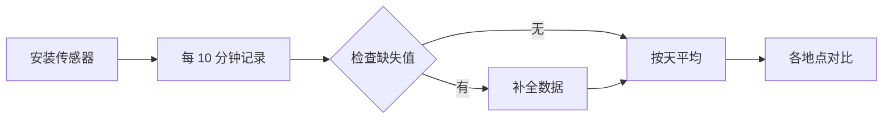

# 屋顶菜园到底有多凉快

**摘要** — 我们在三处屋顶菜园和一处空屋顶上，用了 ~~一个月~~ 两个月的时间，记录了夏季的气温、湿度和地表温度。种了植物的屋顶，午间气温平均低 **2.4 °C**，太阳下山后降温也*明显*更快。本文整理了观测方法、结果和尚未解答的问题。

> 城市的热，先从小小的屋顶上散去，而不是大大的公园。
>
> — 现场记录本，7 月 21 日

## 1. 观测方法

我们在四个地点放置了同一型号的传感器，每 **10 分钟**记录一次。各地点的情况如下。

| 地点 | 楼层 | 植物 | 土层厚度 | 午间平均气温 |
|---|---:|---|---:|---:|
| A · 朝阳公寓 | 5 | 蔬菜 · 香草 | 25 cm | 31.2 °C |
| B · 松林商场 | 4 | 草坪 | 15 cm | 31.8 °C |
| C · 星光图书馆 | 3 | 多年生花草 | 30 cm | 30.9 °C |
| D · 空屋顶（对比用） | 5 | 无 | — | 33.6 °C |

气温差用与空屋顶的差值 $\Delta T = T_D - T_i$ 表示，并按天取平均。

$$
\overline{\Delta T} = \frac{1}{N} \sum_{k=1}^{N} \left( T_{D,k} - T_{i,k} \right)
$$

求平均的代码很短。

```python
import pandas as pd

log = pd.read_csv("rooftop_log.csv", parse_dates=["time"])
daily = (log.pivot(index="time", columns="site", values="temp")
            .resample("D").mean())
delta = daily["D"] - daily[["A", "B", "C"]].T  # 与空屋顶的差值
print(delta.T.mean().round(2))
```

## 2. 结果


*图 1 — 逐时气温（°C）。红色为空屋顶，绿色为三处菜园的平均值。*

下午 2 点前后差距最大，土层最厚的 C 地点最凉快。从观测到分析的流程如下。



## 3. 待解答的问题

- [x] 有无植物对午间气温的影响
- [x] 太阳下山后的降温速度
- [ ] 在更多地点验证土层厚度与凉爽程度的关系
- [ ] 冬季的保温效果

太阳下山后两小时内的降温幅度，按日期整理在[观测记录](./观测记录.json)里。
